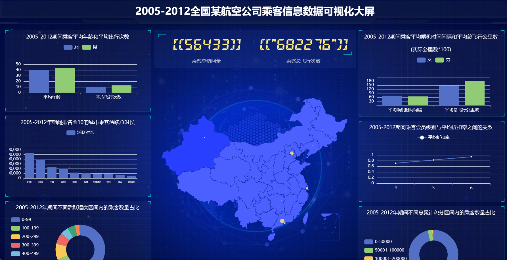

# 基于Flask+Echarts的航空公司乘客信息数据可视化大屏
### 1.环境配置
```Python
    Flask==1.1.2
    numpy==1.24.0
    pandas==1.4.4
    pyecharts==2.0.4
    PyMySQL==1.1.0
```
### 2.项目结构
```Python
    CSV数据集
    SQL文件
    static 静态资源
    templates 模板页面
    数据存储
    数据提取和清洗
    app.py 项目启动文件
    mysql.py  数据库连接
    REARME.md 阅读文档
    requirements.txt 依赖包
```
### 3.数据可视化流程
- 3.1 数据提取与清洗：
- 通过使用numpy,pandas等工具对air_data.csv中的数据进行冗余数据清洗，图表数据提取等操作，并将清洗好的数据保存为CSV文件。
- 3.2 数据存储：
- 通过方法Data_save_mysql，将CSV数据存储到MySQL数据库当中。
- 3.3 Flask后端开发->app.py
- 将数据库中查询到的数据，传递给前端页面，并满足Echarts图表的数据规范。
- 3.4 前端开发->index.html
- 接收后端传递的数据，结合Html/CSS/JS的基本语法和Echarts语法，让后端的数据正常显示。
### 4.图表统计内容
- 4.1 乘客平均年龄和平均出行次数-柱状图
- 4.2 乘客平均乘机时间间隔和平均总飞行公里数-柱状图
- 4.3 排名前10的城市乘客活跃总时长-柱状图
- 4.4 乘客会员级别与平均折扣率之间的关系-折线图
- 4.5 不同活跃程度区间内的乘客数量占比-环状图
- 4.6 不同总累计积分区间内的乘客数量占比-环状图
- 4.7 来自全国地区的乘客出行次数-中国地图
- 4.8 乘客总访问量和乘客总飞行次数
### 5.项目实现效果图

### 6.相关学习链接
- Echarts官网 https://echarts.apache.org/zh/index.html
- Flask官网 https://flask.palletsprojects.com/